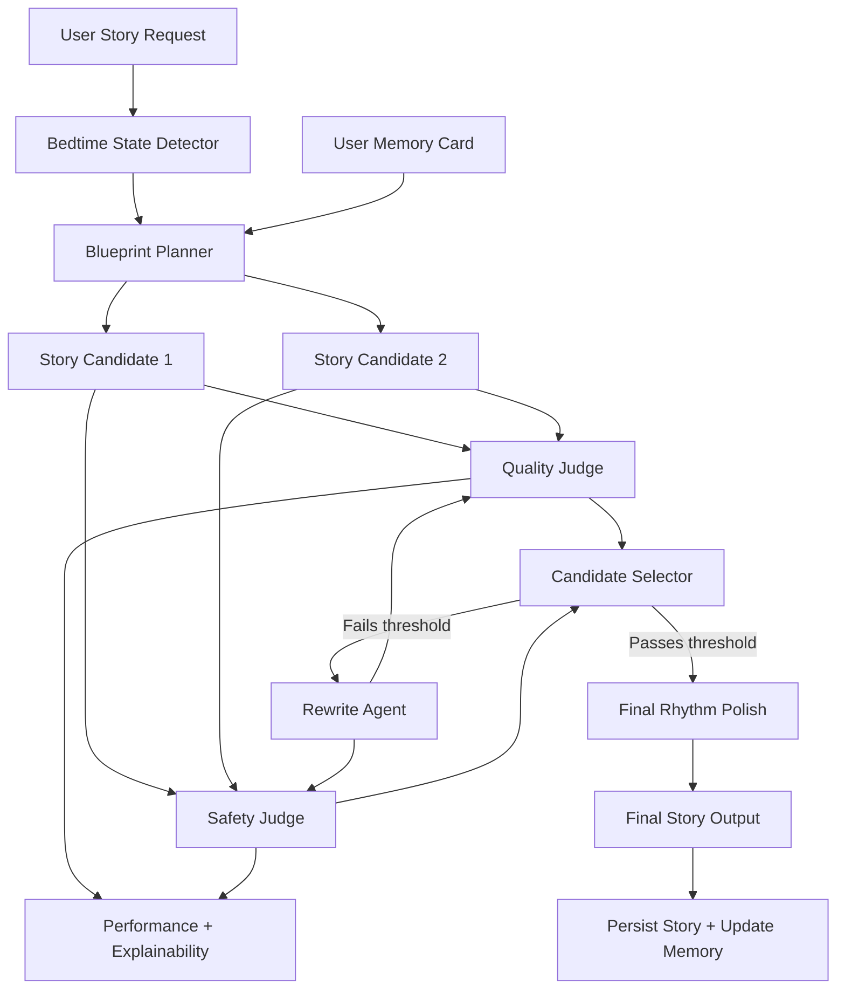

# System Block Diagram

## Notes
- The model is fixed to `gpt-3.5-turbo` as required.
- Uses dual judges: quality and pediatric safety.
- Uses self-play candidate generation and selects highest combined quality+safety score.
- Memory card carries user continuity signals across nights.
